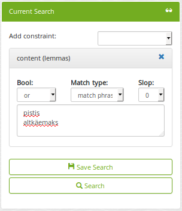
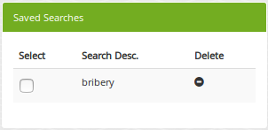
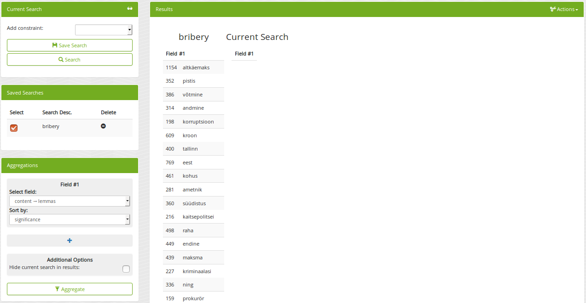
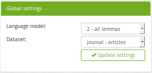
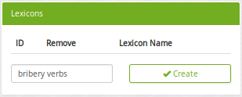
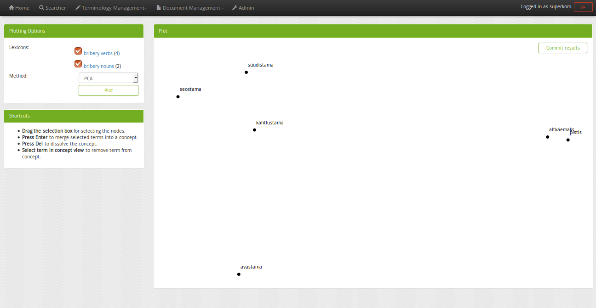
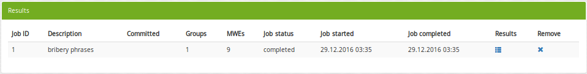
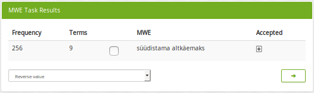

Workflow
========

The beginning
-------------

After starting TEXTA, as described in the :ref:`installation step <running-texta>`, the next intuitive thing is to start using it.
Since it is a web application, we have to navigate to the corresponding address in our browser
(e.g. `http://localhost:8000/ <http://localhost:8000/>`_ if running locally). We are welcomed by a login page as depicted in 
Figure 1.

.. _figure-1:

.. figure:: images/01_welcome.png

    Figure 1. *Welcome screen*
    
    1. Login area
    2. Create user

Login page allows to login, as well as create a user. 

When using the TEXTA instance for the first time, it is crucial to login with the super user account set up in the
:ref:`installation's final touches <final-touches>`. Super user account is much like an account one can create from the "Create user" button,
with the difference that it has additional rights to access some sensitive features like user permissions, user deletion and defining datasets.

After the log in
----------------

Once we have logged in with our super user (currently by the name of "superkom"), we reach the home page, which looks much like the page before,
with the exception of a list of tools and some global settings.

.. _figure-2:

.. figure:: images/02_after_login.png

    Figure 2. *Home page*
    
    1. Tools
    2. Global settings
    3. Admin panel

.. note::

    Admin panel is only visible to super users.
    
As we can see from the global settings panel, we don't have access to any datasets. A data analytics tool without data is not too intriguing.
Therefore, we need to link our data, which resides in Elasticsearch.
    
Setting up datasets
-------------------

First off, we need a populated Elasticsearch index such as defined in :ref:`setting up example dataset <example-dataset>`.

Once we have a dataset in Elasticsearch, we have to tell TEXTA that we are interested in accessing it. We can do that from the "Admin panel".

.. _figure-3:

.. figure:: images/03_admin_panel.png

    Figure 3. *Admin panel*
    
    1. User management
    2. Dataset management
    
One TEXTA instance can have only one Elasticsearch database which may have many indices. In dataset management, we can list the indices and 
mappings we are interested in. By choosing the desired index, corresponding mapping and a daterange, we can link the dataset to TEXTA. Daterange acts as a
filter for [TODOOOOO map searcher] Searcher's aggregations. If we are not interested, we can set the "to" and "from" to
some arbitrarily late and early dates respectively.

If we are using the example dataset, we should insert something like on the following figure (date range may differ). We're adding mapping
"articles" from index "journal".

.. figure:: images/03-1_admin_panel_filled_in.png

    Figure 3.1. *Filled dataset management fields*
    
After successfully linking an Elasticsearch mapping to TEXTA, we should see a panel with the following entry.

.. figure:: images/03-2_admin_panel_first_entry.png

    Figure 3.2. *First dataset entry*
    
If we now head back to the home page, we should see that our new entry is chosen by default in the "Global settings" panel.

.. figure:: images/03-3_home_page.png

    Figure 3.3. *Back on home page*
    
Clicking on "Updage settings" will activate the chosen entry. Activated dataset will be used in all our tools.

In figure 3.3 there is still a gap - we are missing a language model. Language model is used to generate topic related lexicons and much more. 
To train language models, we have to navigate to "Model Manager" under "Document Management" tab in the tool menu.

However, training language models needs a *search* to limit the number of processed documements. Training on all will often take too long.

Searches
--------

"Searcher" tool is responsible for both creating the searches for language models and browsing-summarizing the data. After we have activated
a dataset, we can familiarize ourselves with the data using the tool.

Searcher's graphical interface consists of serveral important panels, which are depicted in figure 4.

.. figure:: images/04_corpus_tool.png

    Figure 4. *Searcher's first look*
    
    1. Current Search
    2. Saved Searches
    3. Aggregations
    4. Results
    
Creating a new search
+++++++++++++++++++++

Data browsing and summarization depend on searches. Search consists of a set of constraints on feature values. We can define our constraints on
the data using the "Current Search" panel. Without saving the constraints, we are in a "test mode", which means that we can use the search in
Searcher, but we cannot use the search in other tools. After saving the search, it is available also to other tools.

In order to add a constraint, we must first choose a field. After the field is selected, we can then specify which textual tokens should or
must occur in the interested document subset.

Suppose we are interested in finding all the documents which contains "bribery" in Estonian. It makes sense to abuse lemmas
whenever possible to account for inflection.

    Figure 4.1. *"Bribe" search constraints*

Figure 4.1 shows how we have defined that we want to find all the documents which contain either "pistis" *or* "altkäemaks"
("bribery" in Estonian). "Match" and "Match phrase" mean that we want to find exact matches, whereas "Match phrase prefix" matches prefixes
(meaning suffixes may differ).

Should we be interested in more detailed searches, we can add more constraints like the previous one.

After we have come up with a suitable search, we can save it for later uses.
 
 
Browsing data
+++++++++++++

If we click on "Search" button, we will see the matching data in a tabular form, where layered features share feature name's prefix, and
matches are highlighted.

.. figure:: images/04-2_bribe_results.png

    Figure 4.2. *Bribe search results*

We can see some basic statistics and if there are too many features, we can hide them by clicking on their green names.

Exporting data
++++++++++++++

Sometimes we want to work with a subset of data in some other application or external calculation. For example, we might want to train a 
classifier on enriched sample. To get the enriched sample (in which some classes or tokens are over-represented), we can apply the search
constraints to retrieve the data and then use query result actions, such as *export*.

.. figure:: images/04-3_export_panel.png

    Figure 4.3. *Export panel*

Export panel allows to specify, how many rows and which features are we interested in.
    
    
Deleting data
+++++++++++++

The second action on search results is deletion - if we detect some malformed data or are simply not interested in some subset, we can remove it
permanently from the Elasticsearch.
    
Using saved searches
++++++++++++++++++++

Searches can be saved. If we save our "bribery" search under "bribery", we can see it being listed in "Saved Searches" panel.

    Figure 4.4. *Saved searches*

Now, whenever we check it, we can use it to browse data or apply in summarization.
    
Summarizing data
++++++++++++++++

As fun as browsing through the data is, it is not always enough. Sometimes we want to get an overview of our data, such as topics over time or
word distributions. Searcher allows to do all of that and more through the "Aggregations" panel.

Aggregations have two components - data and features it aggregates over. Selecting a search determines the sample we get our data from. By defining a feature, we can group by that feature and get
category counts. For example, lets assume we are interested in seeing how are the top words distributed in our sample data defined by our
"bribery" search. By requesting aggregation as shown on figure 4.5, we get the result on the same figure.

.. figure:: images/04-5_simple_aggregation.png

    Figure 4.5. *Simple aggregation*

From the results we can see raw word distributions for both checked "bribery" search and "Current Search" (which doesn't have any constraints,
a.k.a sample is all the data we have). Since we queried raw count, many common words overlap. We can change "Sort by" setting to significance
in order to get uncommon over-represented words for that specific sample dataset.

    Figure 4.6. *Aggregation sorted by significance*

In figure 4.6 we can see that now the words are much more specific to the "bribery" dataset. "Current Search" has no results, because it is
used as prior.
    

.. note::

    Let's also define and save an empty search (without any constriants) under "all" to include all the data.
    
    
Training language models
------------------------

Now that we have saved some searches, we can train a language model to start creating topic specific lexicons. Language models can be trained
with "Model Manager" tool under "Document Management".

.. figure:: images/05_model_manager.png

    Figure 5. *Model Manager*

    1. New model parameters
    2. Trained models
    
.. note::

    Language models can currently be trained and the tool be seen only by super users.
    
To train a model, we need to specify the training data (by using the corresponding search), feature, and hyperparameters. When we are interested
in creating lexicons, lemma layer is often the wisest, as it reduces data sparsity.

We can reduce the lexicon or data sparsity further by coding punctuation and numbers. This means that we replace all occurrences of
punctuation marks with a single token and numbers with another one. Replacing numbers makes often sense when training language models, as
different numerical values rarely add any semantical value.

Let's train a new language model on our whole data. For that we use our "all" search without any constraints.

.. figure:: images/05-1_model_parameters.png

    Figure 5.1. *Model parameters*
    
After starting the model training task, we can see the progress. For progress upgrade, we have to refresh the page.
    
.. figure:: images/05-2_model_training_progress.png

    Figure 5.2. *Model training progress*
    
Once the training completes, we can see the following.

.. figure:: images/05-3_model_training_completed.png

    Figure 5.3. *Training completed*
    
    
Setting up a language model
---------------------------

Now that we have trained a language model, we can activate it from the home page by selecting the model and updating settings.

    Figure 6. *Activating language model*
    

Creating lexicons
-----------------

We can start creating topic-related lexicons. From toolbar we can find "Base Lexicon Miner" under "Terminology Management".

Let's create a lexicon that contains verbs accompanied with "bribery".

    Figure 7. *Creating lexicon of bribery verbs*
    
After clicking on the newly created lexicon, we have to provide some seed words.

.. figure:: images/07-1_lexicon_seed_words.png

    Figure 7.1. *Providing seed words*
    
The process of creating (or expanding) the lexicon is iterative. We keep asking for suggestions and from those we have to pick the ones that
make sense to us. We keep asking for suggestions until we get no more meaningful responses. Then we should either change to some approach with
"preclustering" in it or end the process, as the training data didn't give us more.

The first batch of suggested words are shown in figure 7.2.

.. figure:: images/07-2_first_suggestion_batch.png

    Figure 7.2. *First suggestion batch*
    
The first suggested word - "kahtlustama" - makes sense, while the others not so much. To add it to the lexicon, we simply have to click on it. In the next batches
we also get "seostama" and "avastama". However, the yield is not as good as we hoped for. The reason behind this is that the training data is
too small. We had less than 5000 documents, most of which didn't even contain the relevant words and therefore the model had difficulties during
the training phase.

Creating concepts
-----------------

Once we have saved the lexicons we are interested in, the next step would be to group parts of them into concepts. A lexicon may contain 
somewhat similar words which still differ from one another in some important aspects. Concepts are created with "Conceptualiser" under 
"Terminology Management". It takes lexicons as input and outputs concepts, which user defines using the graphical tool. Words are displayed on
scatter plot and user can group them using selection box or merge one by one using the *enter* key.

Word coordinates in scatter plot are derived by applying dimension reduction on high dimension word vectors. Word vectors are relying on
distributional semantics, meaning that words with similar context are similar and have in our case similar vectors - or are close to each other
in 2-dimensional space.

One of several dimension reduction methods can be chosen, but they give approximately the same results.

In our scenario, we have small and homogeneous lexicons and therefore each lexicon forms just one concept.

After checking the lexicons and plotting them, we get to the state depicted in figure 8.

    Figure 8. *Conceptualiser's initial plot*

We can visually detect that two more or less coherent clusters have formed and "avastama" is an outlier. It was also the last word suggested by
*Lexicon Miner*. For that reason we leave that word out from our concepts.

.. figure:: images/08-1_grouped_concepts.png
    
    Figure 8.1. *After grouping the words into concepts*
    
Now that we have found the concepts, we can commit the changes to save them.

.. note::

    Concepts can be used in *Searcher* by prepending an "@"-sign. So we don't have to list words one by one. They can also be used in the same
    manner in *Grammar tool*.
    
Mining multi-word expressions
-----------------------------

Mining multi-word expressions is a way to find actually used phrases. We approched the problem bottom-up. First we defined the individual tokens
and now we try to find which of them are located nearby or side-by-side. Ideally, phrases should be found using the words with inflection data,
but since our dataset is small, we have to make it with lemmas and low frequency threshold.

Mining task requires parameters - much like training language models. In figure 9 we can see the parameters we can use.

.. figure:: images/09-mwe_parameters.png

    Figure 9. *Multi-word expression mining parameters*

We have to define the feature or field, which should be the same we trained our language models on for mining lexicons. Expression lengths
determine the output phrase lengths (or combination lengths, which are searched for). Phrase occurrencies below frequency threshold are ignored
and slop determines, how far apart can the words be from one another. Finally, we have to specify the lexicons used. Since we want to find
bribery phrases which contain both noun and accusing verb, we check both lexicons.

Because the data and lexicons are small, the task completes instantly.

    Figure 9.1. *Multi-word expression task progress*

By looking at the results, we can see that the only frequent enough phrase included "süüdistama" and "altkäemaks", meaning that the articles
did not make any allegations before the cases reached the attention of the court.

    Figure 9.2. *Multi-word expression results*

Exracting information
---------------------

