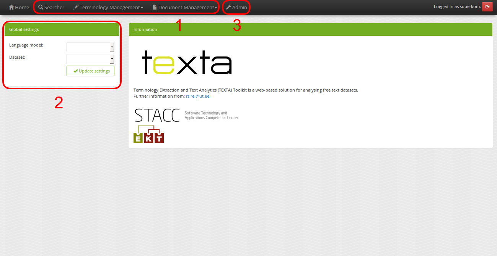
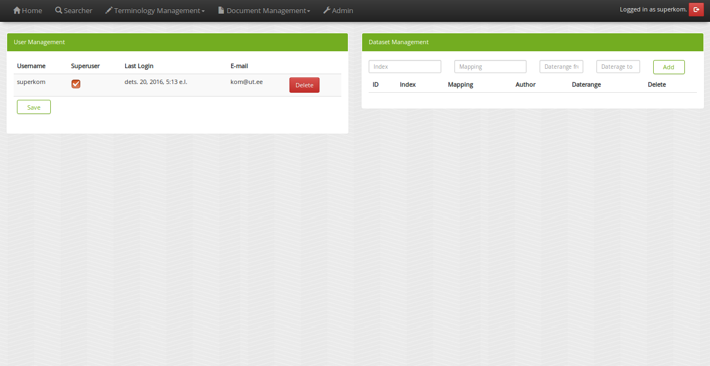

Workflow
========

The beginning
-------------

After starting TEXTA, as described in the :ref:`installation step <running-texta>`, the next intuitive thing is to start using it.
Since it is a web application, we have to navigate to the corresponding address in our browser
(e.g. `http://localhost:8000/ <http://localhost:8000/>`_ if running locally). We are welcomed by a login page as depicted in 
Figure 1.

.. _figure-1:

.. figure:: images/01_welcome.png

    Figure 1. *Welcome screen*
    
    1. Login area
    2. Create user

Login page allows to login, as well as create a user. 

When using the TEXTA instance for the first time, it is crucial to login with the super user account set up in the
:ref:`installation's final touches <final-touches>`. Super user account is much like an account one can create from the "Create user" button,
with the difference that it has additional rights to access some sensitive features like user permissions, user deletion and defining datasets.

After the log in
----------------

Once we have logged in with our super user (currently by the name of "superkom"), we reach the home page, which looks much like the page before,
with the exception of a list of tools and some global settings.

.. _figure-2:

    Figure 2. *Home page*
    
    1. Tools
    2. Global settings
    3. Admin panel

.. note::

    Admin panel is only visible to super users.
    
As we can see from the global settings panel, we don't have access to any datasets. A data analytics tool without data is not too intriguing.
Therefore, we need to link our data, which resides in Elasticsearch.
    
Setting up datasets
-------------------

First off, we need a populated Elasticsearch index such as defined in :ref:`setting up example dataset <example-dataset>`.

Once we have a dataset in Elasticsearch, we have to tell TEXTA that we are interested in accessing it. We can do that from the "Admin panel".

.. _figure-3:

    Figure 3. *Admin panel*
    
    1. User management
    2. Dataset management
    
One TEXTA instance can have only one Elasticsearch database which may have many indices. In dataset management, we can list the indices and 
mappings we are interested in. By choosing the desired index, corresponding mapping and a daterange, we can link the dataset to TEXTA. Daterange acts as a
filter for [TODOOOOO map searcher] Searcher's aggregations. If we are not interested, we can set the "to" and "from" to
some arbitrarily late and early dates respectively.

If we are using the example dataset, we should insert something like on the following fugure (date range may differ). We're adding mapping
"articles" from index "journal".

.. figure:: images/03-1_admin_panel_filled_in.png

    Figure 3.1. *Filled dataset management fields*
    
After successfully linking an Elasticsearch mapping to TEXTA, we should see a panel with the following entry.

.. figure:: images/03-2_admin_panel_first_entry.png

    Figure 3.2. *First dataset entry*
    
If we now head back to the home page, we should see that our new entry is chosen by default in the "Global settings" panel.

.. figure:: images/03-3_home_page.png

    Figure 3.3. *Back on home page*
    
Clicking on "Updage settings" will activate the chosen entry. Activated dataset will be used in all our tools.